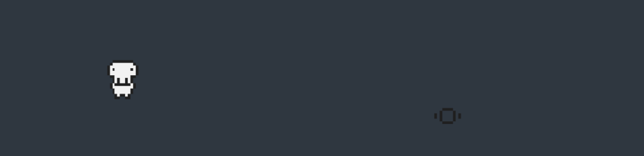

# tdws

## Naming Conventions & Project Structure
todo

## References and Inspiration
* [Make Pro 2d Games with Godot](https://github.com/GDquest/make-pro-2d-games-with-godot)
* [Best practices](https://docs.godotengine.org/en/3.1/getting_started/workflow/best_practices/index.html)
